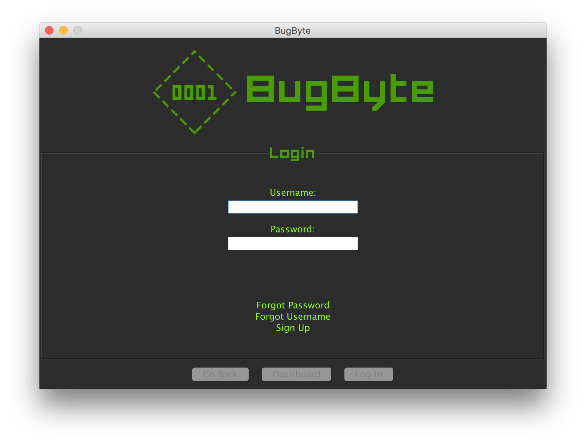

---
<br>



This is an application, written in Java as an assignment for CPS406 (Intro to Software Engineering), which emulates a bug report system. It implements user accounts and a database of bugs of which users can add, remove and edit. Because this is an emulation, information will not be transmitted through the internet and will only be emulated through offline files in which we plan to store the appropriate serializable objects.


---
<br>

## Compilation
<br>

***Please note that OS X/Linux and Windows users must compile BugByteLauncher differently.***


BugByte can be compiled into an executable .jar file using the Makefile provided:

```bash
make clean      # Clean the working directory
make build      # Compile and build executable jar
```
